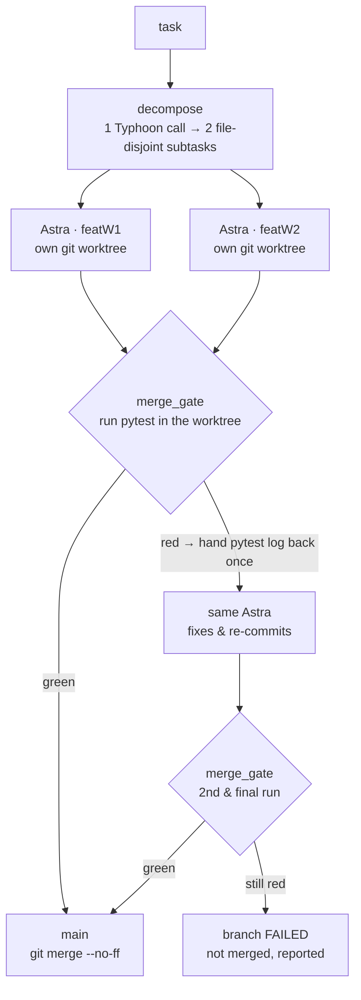

# Astraeus

**Astraeus** is a multi-agent system where an orchestrator (*Astraeus*) decomposes a
task, dispatches worker agents (*the Astra* — the stars) into isolated git worktrees,
and an automated **merge gate** tests each branch and lands it on `main` — agents
collaborating like a disciplined dev team, **with no human touching git**.

## What Phase 0 proved

The full loop runs end-to-end **on a free model** —
[`typhoon-v2.5-30b-a3b-instruct`](https://opentyphoon.ai) over its OpenAI-compatible
API — including **self-repair**: when the gate rejects a branch, the same worker reads
the verbatim test failure and fixes its own code.

Here is the self-repair proof, verbatim from a live run (`--step3-natural`): a worker
was made to commit a deliberately broken `add` (`return a - b`) under a test demanding
`add(2, 3) == 5`.

```
gate attempt 1 → REJECTED:
    def test_add():
>       assert add(2, 3) == 5
E       assert -1 == 5
E        +  where -1 = add(2, 3)
    FAILED test_a.py::test_add - assert -1 == 5
    1 failed in 0.24s

→ hand the pytest log back to the same Astra, exactly once →
   Astra fixes a.py:  return a - b   →   return a + b   and re-commits

gate attempt 2 → PASS → merged

main:
    26086ab merge featW1
    d8031f4 Fix add function to perform addition instead of subtraction
    29784b3 phase 1
    c2d09d6 init
    pytest on main green? True
```

One handback, the cap held, the branch landed. The model read its own failure and
corrected it.

## How it works



- **decompose** is a single structured model call (not an agent): one task → exactly
  two file-disjoint subtasks as strict JSON.
- Each **Astra** is its own agent scoped to its own git worktree, so two workers never
  step on each other.
- **merge_gate** runs the branch's tests and only does `git merge --no-ff` if they pass.
- On failure the gate hands the test log back to the same Astra **once**, then re-runs;
  still failing → the branch is reported FAILED and never reaches `main`.

## Running it

Requires Python 3.11+ and [`uv`](https://docs.astral.sh/uv/). The runtime model is
Typhoon via its OpenAI-compatible API.

1. Create a `.env` in the repo root (**never committed** — it is gitignored):

   ```
   export TYPHOON_BASE_URL="https://api.opentyphoon.ai/v1"
   export TYPHOON_API_KEY="<your-key>"
   ```

2. Install dependencies:

   ```
   uv sync --extra dev
   ```

3. Run an entrypoint:

   ```
   uv run --extra dev python -m src.orchestrator                 # decompose → two Astras → land both on main
   uv run --extra dev python -m src.orchestrator --step3-planted # reject/retry loop, deterministic (no model)
   uv run --extra dev python -m src.orchestrator --step3-natural # reject/retry loop, live self-repair
   ```

   The work repo is a throwaway temporary git repo created at runtime; nothing is
   written into this source tree.

## Phase 1 — harden the unit

Phase 1 makes the unit survive reality. Workers **and** the merge gate now run inside
ephemeral Docker containers, so the **host never executes agent-written code** (the
gate runs `pytest` in its own container); every container runs `--network none` and is
torn down in `finally`; the **API key never enters a container** (model calls happen on
the host — asserted); git worktrees are retired for a **bare origin on a named docker
volume** (no host↔container path translation, concurrent pushes safe); the two workers
run **in parallel**; and a hung model call **can't freeze a run** — each worker is
bounded by a wall-clock cap. Live proof: a deliberate 600-second stall was **capped at
75s and the other branch still landed** (total wall 92.6s), so Phase 0's 19-minute
freeze is impossible by construction.

**Documented capability boundary (stated plainly):** the free worker model
(`typhoon-v2.5-30b-a3b`) **cannot resolve a real merge conflict** — not even add/add,
and not even when handed an explicit worked example. We proved this across three live
runs with three distinct failure modes, under fixed honesty rules (one handback, two
gate runs max, no human resolution, no model swap), and a pre-registered one-shot
trial that **failed**. When a conflict can't be resolved, the gate **refuses to merge
and the branch is reported FAILED** — `main` stays consistent and nothing broken
lands. A mapped boundary with the honesty rules held is a result, not a gap; see
[docs/phase1-findings.md](docs/phase1-findings.md).

## Status

**Phase 0 — walking skeleton — complete** (tag `v0.1.0-phase0`): decompose → two Astras
in worktrees → merge gate → reject/retry-once → land on `main`, on a free model, no
human git. Findings: [docs/phase0-findings.md](docs/phase0-findings.md).

**Phase 1 — hardened unit — complete** (tag `v0.2.0-phase1`): sandboxed workers + gate,
`--network none`, key never in containers, bare origin volume, parallel workers, hangs
bounded by construction, conflict-resolution boundary mapped. Findings:
[docs/phase1-findings.md](docs/phase1-findings.md).

**Phase 2 has not started.** Workers are sandboxed in Docker now, but treat this as a
local development tool, not a hardened multi-tenant service.
