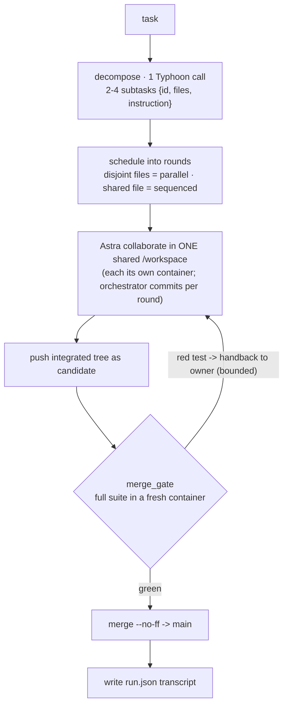

# Astraeus

**Astraeus** is a multi-agent system where an orchestrator (*Astraeus*) decomposes a task,
dispatches worker agents (*the Astra* — the stars) that **collaborate in one shared
filesystem**, and an automated **merge gate** tests their integrated work and lands it on
`main` — a disciplined dev team of agents, **with no human touching git**.

It runs on a **free model** — [`typhoon-v2.5-30b-a3b-instruct`](https://opentyphoon.ai)
over its OpenAI-compatible API — inside Docker sandboxes: every worker is `--network none`,
the API key never enters a container, and the host never executes agent-written code.

- **How to run it:** [docs/USAGE.md](docs/USAGE.md)
- **Full technical architecture (with diagrams):** [docs/ARCHITECTURE.md](docs/ARCHITECTURE.md)

## How it works



1. **decompose** — one Typhoon call splits the task into 2–4 subtasks; files may overlap.
2. **schedule** — file-disjoint subtasks run in parallel; subtasks sharing a file are
   *sequenced* into later rounds. Because same-file work is serialized on one shared tree
   (each later writer reads the previous commit), **git never has to merge** — which
   sidesteps the proven limit that the worker model cannot resolve merge conflicts.
3. **collaborate** — each Astra works in the shared `/workspace` from its own Docker
   container, writing only its assigned files and running no git; the orchestrator commits.
4. **gate** — the integrated tree is pushed as one `candidate` and tested in a fresh
   container (the union of every worker's tests). Green → merged to `main`; a red test is
   handed back to the owning worker, bounded; a stalled worker's partial work is dropped.
5. **transcript** — every run records `/workspace/.astraeus/run.json`.

## Quickstart

Needs Python 3.11+, [`uv`](https://docs.astral.sh/uv/), a running **Docker daemon**, and
Typhoon credentials. Full details in [docs/USAGE.md](docs/USAGE.md).

```bash
# 1. credentials (never committed — .env is gitignored)
printf 'export TYPHOON_BASE_URL="https://api.opentyphoon.ai/v1"\nexport TYPHOON_API_KEY="<key>"\n' > .env

# 2. deps + worker image
uv sync --extra dev
docker build -t astraeus-worker:phase1 .

# 3. run the end-to-end loop on any task
uv run --extra dev python -m src.orchestrator --run "Write add(a,b) with a test, and mul(a,b) with a test."

# or the collaboration demo (two workers edit ONE shared file, sequenced)
uv run --extra dev python -m src.orchestrator --shared-demo
```

Other entrypoints: `python -m src.orchestrator` (default: Phase 1 parallel demo `step3`)
and `--stall` (the bounded-hang demo). Tests: `uv run --extra dev pytest -q` (docker-gated
tests skip cleanly without a daemon).

## Project evolution

- **Phase 0 — walking skeleton** (tag `v0.1.0-phase0`): decompose → two Astra in git
  worktrees → merge gate → reject/retry-once → land on `main`, on a free model, no human
  git, including live self-repair from a test log. [docs/phase0-findings.md](docs/phase0-findings.md).
- **Phase 1 — hardened unit** (tag `v0.2.0-phase1`): sandboxed workers + gate,
  `--network none`, key never in containers, bare origin volume, parallel workers, hangs
  bounded by construction, and a **documented conflict boundary** — the worker model
  cannot resolve a git merge conflict. [docs/phase1-findings.md](docs/phase1-findings.md).
- **Phase 2 — central collaborative workspace** (current): one shared `/workspace` across
  all sandboxes, an N-worker `run_task` loop on `decompose`, orchestrator-sequenced
  same-file edits (so git never merges), bounded red-test repair, harness-aware Astra, and
  a JSON transcript. Orchestration logic is unit-tested (`33 passed`); the docker-gated
  plumbing tests and the live model-driven runs (`--run`, `--shared-demo`) need a Docker +
  Typhoon host. [docs/phase2-findings.md](docs/phase2-findings.md).

Treat this as a local development tool, not a hardened multi-tenant service.
