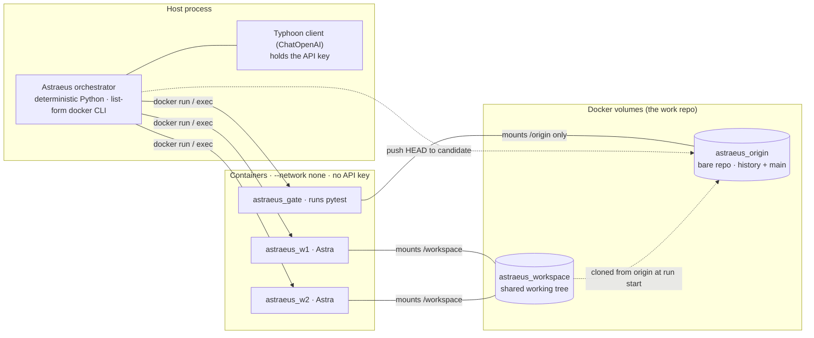
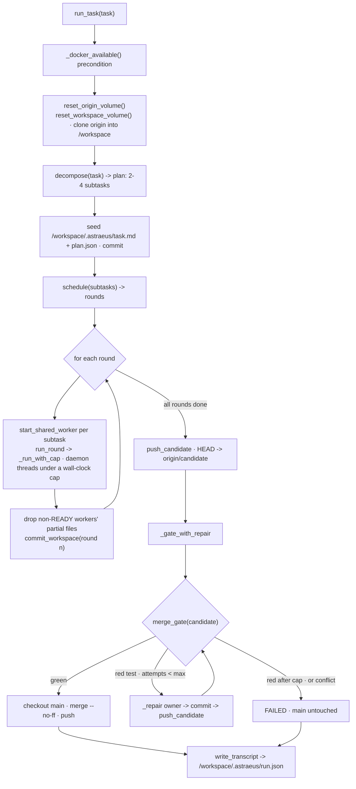
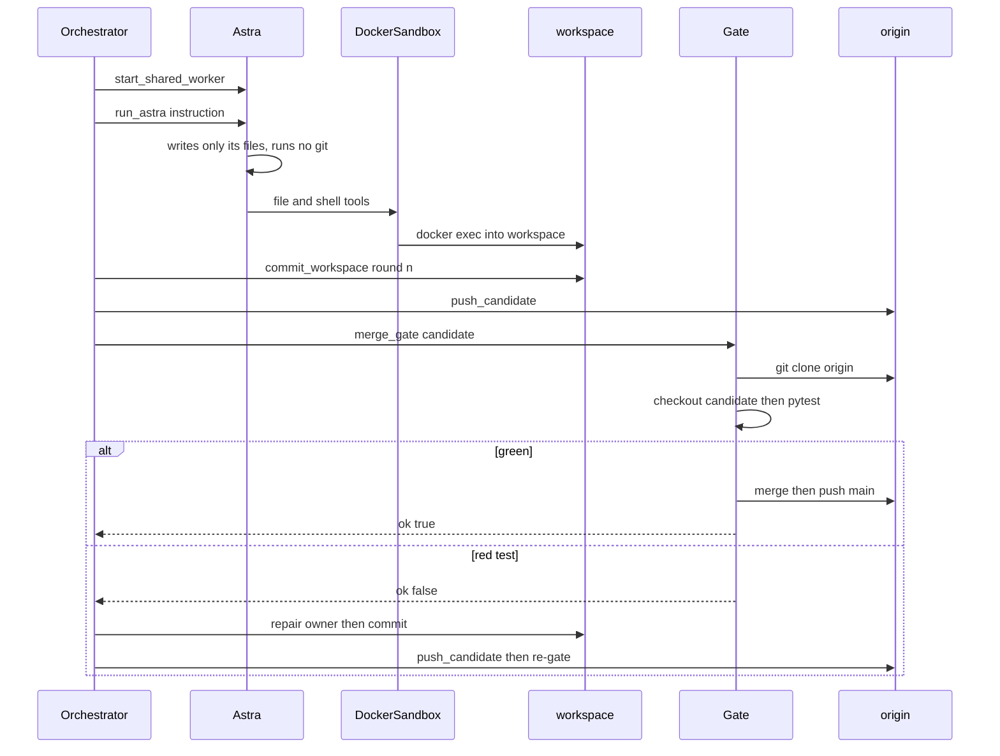
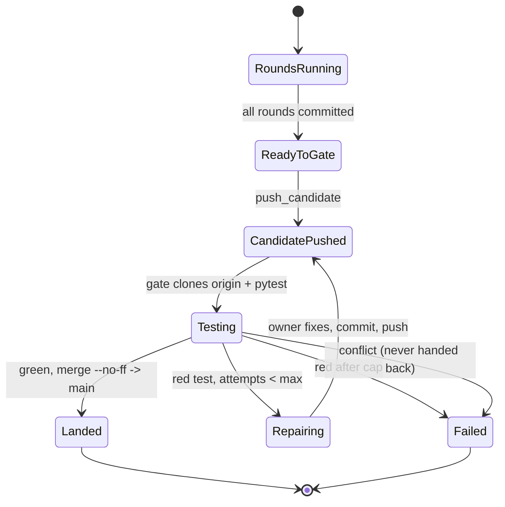
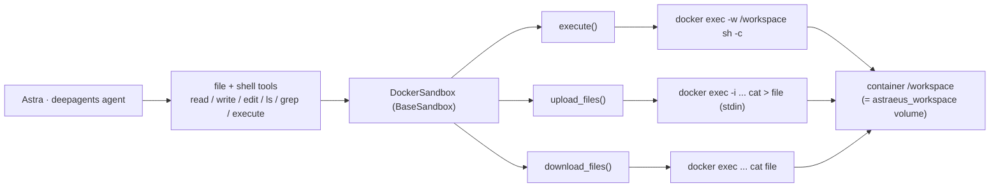

# Astraeus — Architecture

Full technical reference for how Astraeus turns one task into landed, tested code with no
human touching git. For how to run it, see [USAGE.md](USAGE.md); for the phase-by-phase
findings, see [phase0](phase0-findings.md) / [phase1](phase1-findings.md) /
[phase2](phase2-findings.md).

## Overview

Astraeus is an **orchestrator** (deterministic Python on the host) that drives several
**Astra** (LLM worker agents, each in its own Docker container). The orchestrator owns all
git and Docker plumbing; the Astra only write source files. Work is integrated in **one
shared working tree** that every worker mounts, and an automated **gate** tests the
integrated result before it lands on `main`.

### Two repos, not one

1. **The Astraeus source repo** — this repository (orchestrator, workers, gate, prompts,
   tests). You version this.
2. **The work repo** — created at runtime on Docker **volumes**, never on the host
   filesystem. This is where the agents' code, commits, and merges happen.

### Glossary

| Term | Meaning |
| --- | --- |
| **Astraeus** | The orchestrator — plans, dispatches, gates, integrates. Runs on the host. |
| **Astra** | A worker agent (a `deepagents` agent) that implements one subtask inside its container. |
| **`astraeus_origin`** | A Docker volume holding a **bare** git repo: history and the published `main`. |
| **`astraeus_workspace`** | A Docker volume holding the **shared working tree** all Astra read/write at `/workspace`. |
| **round** | A group of subtasks with pairwise-disjoint files, dispatched in parallel. |
| **candidate** | The branch the integrated shared tree is pushed to for gating. |
| **gate** | An ephemeral container that clones origin, runs the full test suite, and merges `candidate`→`main` only on green. |

## Topology



Key properties, enforced in code:

- **`--network none`** on every container — git talks only to local volumes; the model
  runs on the host, so nothing needs the network.
- **The API key never enters a container** — the Typhoon client is built and called in the
  host process (`worker.py:_build_typhoon_model`); containers are started without `-e`.
- **The host never executes agent-written code** — pytest runs inside the gate container;
  every host call is list-form `subprocess` (no shell), via `dcmd()`.
- **The gate never mounts `astraeus_workspace`** — its verdict depends only on committed
  code in origin, so shared scratch can't influence it.

## The `run_task` loop

`run_task(task)` (`src/orchestrator.py`) is the Phase 2 entry point.



Step by step:

1. **`_docker_available()`** — fail loud if the daemon is down (phase1 finding #5).
2. **`reset_origin_volume()` + `reset_workspace_volume()`** — recreate both volumes fresh;
   the workspace is a clone of origin's `main`, so the shared tree starts clean.
3. **`decompose(task)`** — one Typhoon call → a validated plan (see *Data structures*).
4. **Seed context** — write `task.md` + `plan.json` under `/workspace/.astraeus/` and
   commit, so every worker can read the overall task and the full plan.
5. **`schedule(subtasks)`** — group subtasks into rounds (see *Scheduling*).
6. **For each round** — `run_round` starts a fresh container per subtask and dispatches the
   Astra concurrently under a wall-clock cap; then the orchestrator **discards the files of
   any non-READY worker** (so partial/stalled work is never committed) and commits the
   round. A later round therefore reads the previous round's committed code.
7. **`push_candidate()`** — push the integrated tree's HEAD to `origin/candidate`; `main`
   is untouched.
8. **`_gate_with_repair()`** — gate the candidate, with bounded red-test repair.
9. **`write_transcript()`** — persist the structured run record.

### Scheduling — why git never has to merge

`schedule()` is greedy first-fit: a subtask joins the first round whose files are disjoint
from it; otherwise it starts a new round. So **within** a round all subtasks are pairwise
file-disjoint (safe to run in parallel), and any two subtasks that **share** a file land in
**different** rounds. Rounds run in order with a commit between them, so a worker editing a
shared file in a later round does a read-modify-write on the previous writer's committed
content. There are never two divergent versions of a file, so **git is never asked to do a
three-way merge** — which matters because Phase 1 proved (FINAL) the worker model cannot
resolve a merge conflict. The only failure mode left at the gate is a **red test**, which
the model *can* self-repair.

All-disjoint subtasks collapse to a single round — full parallelism, identical to Phase 1's
happy path.

### One round + the gate



### The candidate through the gate



The repair loop is bounded by `max_attempts` (default 2 = one repair). A **conflict** is
never handed back to the model — it short-circuits to FAILED, honouring the Phase 1 finding.

## The sandbox: how an Astra's tools reach a container

Each Astra is a `deepagents` agent whose backend is a `DockerSandbox` (a `BaseSandbox`).
`deepagents` derives every file tool from three primitives, which `DockerSandbox` routes
into the container via the `docker` CLI — so the agent's reads, writes, and shell all
happen inside its sandbox.



## Data structures

**Decompose plan item** (`src/decompose.py`, validated by `_validate`):

```json
{ "id": "w1", "files": ["a.py", "test_a.py"], "instruction": "..." }
```

Rules: 2..`MAX_WORKERS` subtasks; unique `id`s; non-empty `files` (strings); non-empty
`instruction`. Files **may** overlap across subtasks (scheduling sequences them).

**Runnable subtask** (built in `run_task`):

```python
{ "id": "w1", "branch": "w1", "worker": "astraeus_w1",
  "files": [...], "instruction": "...", "harness": "<per-worker context block>" }
```

`branch` is the in-run identifier (no per-worker git branch exists in Phase 2);
`worker` is the container name `astraeus_w{i}`.

**`MergeResult`** (`src/merge_gate.py`):

```python
@dataclass
class MergeResult:
    ok: bool                 # green + merged
    log: str = ""            # pytest output, merge/push error, or timeout message
    conflicts: list = []     # unmerged files (only the legacy branch-merge path)
```

**Run transcript** `/workspace/.astraeus/run.json` (built in `run_task`):

```python
{ "task": str, "plan": [...], "rounds": [["w1","w2"], ["w3"]],
  "outcomes": {"w1": "READY", "w3": "FAILED_TIMEOUT"},
  "gate_attempts": int, "landed": bool,
  "gate_state": str,   # landed | retry_exhausted | repair_no_owner | conflict
  "gate_log": str, "origin_log": str,
  "timeline": [{"t": 0.12, "id": "w1", "event": "astra dispatch begin"}, ...] }
```

## Runtime & model

- **Model** (`worker.py:_build_typhoon_model`): `langchain_openai.ChatOpenAI` pointed at
  `TYPHOON_BASE_URL` with `TYPHOON_API_KEY`, model `typhoon-v2.5-30b-a3b-instruct`,
  `temperature=0`, `timeout=60`, `max_retries=2`. Built per-Astra **on the host**.
- **Agent** (`worker.py:make_astra`): `create_deep_agent(model, system_prompt, backend)`.
  The system prompt is `ASTRA_SHARED_SYSTEM_PROMPT` (no git; write only assigned files;
  test only your own file) plus a per-worker `ASTRA_HARNESS_TEMPLATE` block (what it owns,
  its siblings, where the task/plan live). The Phase 1 `ASTRA_SYSTEM_PROMPT` (isolated
  clone; the worker commits) is kept for the legacy demos.
- **Image** (`Dockerfile`): `python:3.11-slim` + `git` + `pytest`, with a baked-in
  non-interactive git identity. Tag `astraeus-worker:phase1`.

## Configuration & constants

Hardcoded, opinionated — no config layer. Change them at the source.

| Constant | Where | Meaning |
| --- | --- | --- |
| `IMAGE` | `docker_backend.py` | Worker/gate image tag (`astraeus-worker:phase1`). |
| `ORIGIN_VOLUME` | `docker_backend.py` | Bare-repo volume (`astraeus_origin`). |
| `WORKSPACE_VOLUME` | `docker_backend.py` | Shared working tree volume (`astraeus_workspace`). |
| `MAX_WORKERS` | `docker_backend.py` | Cap on subtasks per task (`4`). |
| `WORKDIR` / `DEFAULT_TIMEOUT` | `docker_backend.py` | Container cwd (`/workspace`) / per-`docker exec` timeout (120s). |
| `ASTRA_CAP_SECONDS` | `orchestrator.py` | Per-Astra wall-clock cap (`300`). |
| `GATE_TEST_TIMEOUT` | `merge_gate.py` | Cap on the gate's pytest run (`300`); overrun → clean red. |

## Phase 1 legacy path (historical)

The `step1` / `step2` / `step3` / `step3_stall` entrypoints and `run_parallel` implement
the **earlier** model and are kept as runnable demos (they encode the phase findings,
including the negative conflict result — do not delete):

- Each worker gets its **own isolated clone** and its **own branch** (`start_worker`),
  commits inside its container, and the orchestrator pushes the branch.
- The gate **merges branches** onto `main` one at a time (`_gate_ready` + `merge_gate`).
- `step2` deliberately forces a shared file to produce a real merge conflict and hand it
  back once (`HANDBACK_MSG`) — the experiment that established the conflict boundary.

Phase 2 replaces per-worker branches + branch merges with **one shared tree + scheduling**,
eliminating the merge step (and the conflict class) entirely. `run_parallel` and
`run_round` share the same proven cap/stall core (`_run_with_cap`).

## File map

| File | Responsibility |
| --- | --- |
| `src/orchestrator.py` | The orchestrator: volumes, scheduling, the round loop, the gate+repair loop, `run_task`, the demos. |
| `src/worker.py` | The Astra factory, system prompts/harness, the Typhoon model, the `SleepyModel` stall stub. |
| `src/decompose.py` | One structured Typhoon call → a validated N-subtask plan. |
| `src/merge_gate.py` | The sandboxed quality gate (test in a fresh container; merge on green). |
| `src/docker_backend.py` | `DockerSandbox` (file tools → `docker exec`), `dcmd`/`_docker`, constants. |
| `src/env.py` | Minimal `.env` loader (no dependency). |
| `Dockerfile` | The worker/gate image. |
| `tests/` | Logic tests (no docker/model) + docker-gated plumbing tests. |

## Known limitations / audit notes

- **Model discipline is prompt-enforced, not code-enforced.** "Run no git", "write only
  your files", and "read-modify-write a shared file without deleting a sibling's work" are
  instructions the worker must follow. The gate's full suite is the backstop: a violation
  surfaces as a red test → bounded repair, or an honest FAILED. This is the central
  empirical risk and is unverified until live runs on a Docker + Typhoon host.
- **No per-contribution isolation at the gate** (by design). The integrated tree is gated
  as one `candidate`, so the gate runs the *union* of all tests — but one broken file fails
  the whole suite until repaired.
- **Owner mapping for repair is heuristic** — `_owner_for_failure` matches whole `*.py`
  tokens in the pytest log; with flat filenames this is precise, but an unusual layout could
  still misattribute (the gate re-verifies, so the worst case is an honest FAILED).
- **`decompose._validate` does not forbid slashes** in filenames; the prompt asks for a flat
  layout, but a model that emits `src/a.py` would pass validation.
- **Cosmetics:** the image tag says `phase1` (reused for Phase 2); `pytest` is unpinned in
  the Dockerfile; `pyproject.toml` version is `0.0.0`.
- **Verification status:** orchestration logic is unit-tested (`34 passed`); docker-gated
  tests and live `--run` / `--shared-demo` runs are pending a Docker + Typhoon host. See
  [phase2-findings.md](phase2-findings.md).
