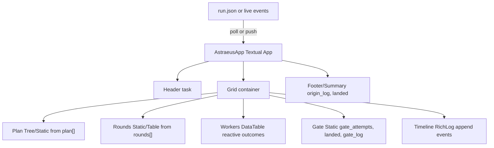

# TUI Frameworks — Survey + a Concrete TUI Design for Astraeus

> Research report. **Part 1** is verified library facts with source URLs. **Part 2** is a
> design proposal for an Astraeus orchestration dashboard, grounded in the actual data
> the orchestrator already emits (`src/orchestrator.py::run_task`). Facts and proposal are
> kept clearly separated. Web facts current as of **June 2026**.

---

## Part 1 — Library survey (verified facts + trade-offs)

### Summary table

| Library | Lang | Paradigm | Latest (mid-2026) | Maturity / maintenance | Best fit |
|---|---|---|---|---|---|
| **Textual** | Python | Widgets + CSS, async (asyncio), reactive attributes | **8.2.7** (2026-05-19) | Very active; flagship of Textualize | Rich, app-like dashboards/IDEs; **can also serve to a browser** |
| **Rich** | Python | Renderable objects + `Live` (not a full app framework) | **15.0.0** (2026-04-12) | Very active; underpins Textual | Pretty output, tables, progress, simple live displays |
| **prompt_toolkit** | Python | Layout + key-bindings + event loop | **3.0.52** | Mature, steady | REPLs, line editors, prompts; full-screen apps possible but lower-level |
| **urwid** | Python | Widget tree + `MainLoop`/event loop | **3.0.x** (3.0.0 May 2025; 3.0.3 Sep 2025) | Long-lived; revived, now Py3-only | Classic widget TUIs; legacy/established codebases |
| **blessed** | Python | Terminal capability wrapper (no widgets/loop) | actively maintained (PyPI) | Mature, small-scope | Cursor/color/positioning primitives; build-your-own loop |
| **curses** | Python (stdlib) | Thin C `ncurses` wrapper | stdlib (ships w/ Python) | Stable, ancient API | Minimal deps, Unix-only, you want maximum control/pain |
| **Bubble Tea** | Go | Elm/MVU (Model-Update-View) | **v2.0.0** (2026-02-24), patches to **v2.0.x** | Dominant Go TUI (~40k stars); v2 is first breaking change in 6 yrs | Go CLIs/TUIs wanting a principled state model |
| **Lip Gloss / Bubbles** | Go | Styling / component lib (Bubble Tea companions) | **v2** (2026-02-23) | Active (Charm) | Styling + ready widgets for Bubble Tea |
| **ratatui** | Rust | **Immediate-mode** (redraw every frame) | **v0.30.x** (0.30.0 2025-12-26; 0.30.2) | Active; official successor to tui-rs | Rust TUIs; high-performance, full control |
| **Ink** | JS/TS | **React** components for the terminal | **7.1.0** (2026-06) | Active; React 19 / Node 20+, ESM | Node/TS CLIs; teams who know React (used by many AI CLIs) |

---

### Python

**Textual** — *the modern Python app framework for terminals.*
- **Architecture (verified):** Python API inspired by web dev. Layout/styling via **CSS** (TCSS files / `CSS` strings); a library of ready widgets (DataTable, Tree, Input, Log, etc.); an **event system** with mouse support and animations; built on **asyncio** for smooth concurrent updates; **reactive attributes** that re-render UI when state changes. Built **on top of Rich** for rendering. ([textual.textualize.io](https://textual.textualize.io/), [Real Python](https://realpython.com/python-textual/), [GitHub](https://github.com/Textualize/textual))
- **Browser delivery (verified):** Textual apps run in the terminal **or a browser**. `textual serve app.py` (the `textual-serve` package) launches the app in a subprocess on your machine and streams it to the browser over a websocket — *the app does not run in the browser*; it's server-driven. `textual-web` does the same but generates a public URL with NAT/firewall traversal — "an SSH session rendered in HTML" with **zero front-end code**. ([textual-serve](https://github.com/Textualize/textual-serve), [textual-web](https://github.com/Textualize/textual-web), [PyPI textual-serve](https://pypi.org/project/textual-serve/))
- **Version/maintenance (verified):** Latest **8.2.7** (2026-05-19); recent releases add Kitty key-protocol support, faster resizing, text-selection/auto-scroll, ANSI themes. ([releases](https://github.com/Textualize/textual/releases))
- **Strengths:** highest-level Python option; declarative layout; rich widget set; async-native; same code → terminal + web; strong docs.
- **Weaknesses:** heaviest abstraction in Python land; asyncio mental model; CSS layout learning curve; overkill for trivial output.
- **Best fit:** app-like TUIs — dashboards, IDEs, log viewers, anything multi-panel and interactive.

**Rich** — *rendering layer, not an app framework.*
- **Verified:** Python library for rich text/formatting — tables, progress bars, syntax highlighting, markdown, tracebacks. `Live` gives dynamic/auto-refreshing displays. It is the **rendering foundation under Textual**. Latest **15.0.0** (2026-04-12), Python 3.9–3.14, MIT, by Will McGugan. ([PyPI rich](https://pypi.org/project/rich/), [GitHub rich](https://github.com/Textualize/rich))
- **Strengths:** trivial to drop into any script; gorgeous tables/progress; `Live` covers many "dashboard-lite" needs without a full app.
- **Weaknesses:** no event loop, focus, key handling, or layout engine — you manage redraws yourself; not for interactive multi-panel apps.
- **Best fit:** pretty CLI output and **simple single-region live displays**.

**prompt_toolkit** — *interactive command-line + full-screen apps.*
- **Verified:** library for powerful interactive CLI apps; an advanced pure-Python readline replacement that **also** builds full-screen apps (layout + key bindings; widgets like `TextArea`, `Button`, `Frame`). Current **3.0.52**. (Powers IPython, ptpython.) ([docs](https://python-prompt-toolkit.readthedocs.io/), [full-screen guide](https://python-prompt-toolkit.readthedocs.io/en/stable/pages/full_screen_apps.html))
- **Strengths:** best-in-class line editing/completion/prompts; full-screen capable; mature.
- **Weaknesses:** lower-level than Textual for app layout; no CSS; you assemble more by hand.
- **Best fit:** REPLs, prompt/wizard UX, line editors; full-screen apps when you want fine control without Textual's weight.

**urwid** — *classic Python widget toolkit.*
- **Verified:** console UI library purpose-built for Python (vs curses, a thin C wrapper); high-level widgets, multiple event loops incl. an **AsyncioEventLoop**. **3.0** series (2025) is **Python 3 only**. ([urwid.org](http://urwid.org/), [GitHub](https://github.com/urwid/urwid), [issue #1017](https://github.com/urwid/urwid/issues/1017))
- **Strengths:** long pedigree; flexible widget/loop model; pluggable event loops.
- **Weaknesses:** older, more verbose API; no CSS-like styling; ecosystem momentum has shifted to Textual.
- **Best fit:** existing urwid codebases; classic widget TUIs.

**blessed** — *terminal capabilities, not a framework.*
- **Verified:** styles, colors, and positioning **without clearing the whole screen first**; better Unicode/color than curses; lower-level API; fork of `blessings`. ([PyPI blessed](https://pypi.org/project/blessed/))
- **Strengths:** clean primitives; no heavy framework.
- **Weaknesses:** no widgets, layout, focus, or event loop — you build the app yourself.
- **Best fit:** custom output/positioning where a full framework is overkill.

**curses** (stdlib) — *raw ncurses.*
- **Verified:** thin wrapper over the C curses/ncurses library; mature but quirky.
- **Strengths:** zero extra deps (ships with CPython); ubiquitous on Unix; full control.
- **Weaknesses:** low-level, error-prone API; weak Unicode/color ergonomics; **no Windows in stdlib**.
- **Best fit:** minimal-dependency Unix tools, or when you deliberately want the metal.

### Go

**Bubble Tea (+ Lip Gloss, Bubbles)** — *Elm/MVU for Go.*
- **Verified:** based on **The Elm Architecture** — `Model` (state), `Update(msg)`, `View()`. **v2.0.0 (2026-02-24)**, the **first breaking change in ~6 years**; module path moved to `charm.land/bubbletea/v2`; `View()` now returns a `tea.View` struct; new "Cursed Renderer" + terminal **"mode 2026"** synchronized output. ~40k stars. **Lip Gloss**/**Bubbles** shipped **v2 on 2026-02-23**. ([bubbletea](https://github.com/charmbracelet/bubbletea), [v2.0.0 tag](https://github.com/charmbracelet/bubbletea/releases/tag/v2.0.0), [HN](https://news.ycombinator.com/item?id=47268662))
- **Strengths:** principled, testable state model; great styling via Lip Gloss; dominant Go ecosystem; excellent for streaming/event-driven UIs.
- **Weaknesses:** MVU boilerplate; v2 breaking migration; Go (not Python) — wrong language for Astraeus.
- **Best fit:** Go CLIs/TUIs wanting clean state management and polish.

### Rust

**ratatui** — *immediate-mode Rust TUI, successor to tui-rs.*
- **Verified:** official successor to tui-rs (2023-07-08). **Immediate-mode**: redraw the whole UI each frame. **v0.30.0 (2025-12-26)** reorganized into a **modular workspace** (`ratatui-core`, etc.), added **`no_std`** and a new `ratatui::run()` API; latest **v0.30.2**. ([ratatui](https://github.com/ratatui/ratatui), [v0.30 highlights](https://ratatui.rs/highlights/v030/))
- **Strengths:** very fast; full control; great for performance-sensitive/real-time TUIs; `no_std` reach.
- **Weaknesses:** immediate-mode means you manage all state/layout yourself; more code; Rust learning curve; wrong language for Astraeus.
- **Best fit:** Rust apps; high-perf dashboards, system monitors.

### JS/TS

**Ink** — *React for the terminal.*
- **Verified:** React component model for CLIs; Flexbox layout (Yoga). **v7.1.0** (June 2026); requires **React 19+** and **Node 20+**; **ESM-only**; `<Static>` for append-only logs. ([ink GitHub](https://github.com/vadimdemedes/ink), [npm](https://www.npmjs.com/package/ink))
- **Strengths:** instantly familiar to React devs; component reuse; good for streaming/log-heavy CLIs; strong ecosystem.
- **Weaknesses:** Node runtime + ESM constraints; React overhead for small tools; JS/TS — wrong language for Astraeus.
- **Best fit:** Node/TS CLIs, especially teams already in React.

### How to choose (one-liners)
- **Python, app-like + maybe web:** **Textual.**
- **Python, just pretty output / one live region:** **Rich.**
- **Python, REPL/prompt UX:** **prompt_toolkit.**
- **Python, minimal deps / Unix only:** **curses** (or **blessed** for nicer primitives).
- **Go:** **Bubble Tea.** **Rust:** **ratatui.** **Node/TS:** **Ink.**

---

## Part 2 — A concrete TUI for Astraeus (design proposal)

> This section is a **proposal**, not verified fact. It maps onto the data Astraeus already
> produces in `src/orchestrator.py` (the `run_task` result dict and the transcript at
> `/workspace/.astraeus/run.json`).

### Recommendation: **Textual** (with Rich underneath)

Why Textual fits Astraeus specifically:
1. **Python, no language switch.** Astraeus is Python 3.11+. Textual stays in-stack; adding Go/Rust/Node would violate the project's "no extra deps without asking / opinionated" stance.
2. **Multi-panel live dashboard is its sweet spot.** The run is inherently several concurrent views — plan, rounds, a worker status **table**, a **gate** panel, a scrolling **log/timeline**, a summary. Textual's CSS grid + `DataTable` + `RichLog` + reactive attributes express this directly.
3. **Async-native = clean live updates.** The orchestrator already runs workers in threads and records a timeline with monotonic timestamps. Textual's asyncio loop + a periodic `set_interval` poll (or a pushed-message stream) update panels without blocking rendering.
4. **Reactivity matches the data.** Per-worker `outcomes` and `gate_attempts` are exactly the small state values reactive attributes are for.
5. **Free browser option.** `textual serve` later turns the same dashboard into a shareable web view with zero front-end code.
6. **The transcript already exists.** `run.json` keys are a ready-made model; the TUI is essentially a renderer over that schema.

Trade-offs: Textual adds one real dependency and a CSS/async learning curve, and a full app is more code than a Rich `Live` panel. If the goal were only a single live progress region, **Rich `Live` alone** would be the lighter, honest choice (noted as the fallback below).

### Data → panel mapping (verified data shapes from `run_task`)

| Transcript key | Shape (verified) | Panel |
|---|---|---|
| `task` | str | Header subtitle |
| `plan` | `[{id, files:[...], instruction}]` | **Plan panel** (Tree/Table) |
| `rounds` | `[[id, ...], ...]` | **Rounds panel** (parallel within, sequential across) |
| `outcomes` | `{id: "READY"\|"FAILED_TIMEOUT"\|"FAILED_ERROR"}` | **Worker status DataTable** (color-coded) |
| `gate_attempts` | int | **Gate panel** (attempts used vs. cap) |
| `landed` | bool / ids | **Gate/Summary** (what merged to `main`) |
| `gate_log` | str (pytest output) | **Gate panel** / log pane |
| `origin_log` | str (`git log --oneline main`) | **Summary panel** |
| `timeline` | `[{t: float_seconds, id, event}]` | **Scrolling timeline/log** (`RichLog`) |

Timeline `event` strings already emitted: `"thread start"`, `"astra dispatch begin"`,
`"astra dispatch end"`, `ERROR <Type>: ...`, `TIMEOUT at cap=...s -> FAILED ...`. The schedule
line and `"round N/M"`, `"gate red -> handback to <id>"` print lines are also good event sources.

### Screen layout (ASCII)

```
┌─ Astraeus ───────────────────── task: "add(a,b) + mul(a,b) with tests" ── 00:42 ┐
│ PLAN                              │ ROUNDS (║ = parallel, → = sequential)        │
│ ▸ featW1  a.py, test_a.py         │  R1:  featW1 ║ featW2                        │
│     "implement add(a,b)…"         │  R2:  featW3                 (shares a file) │
│ ▸ featW2  b.py, test_b.py         │                                             │
│     "implement mul(a,b)…"         │  schedule: featW1+featW2 | featW3            │
├───────────────────────────────────┴─────────────────────────────────────────────┤
│ WORKERS                                                       │ GATE              │
│  id      files            status         dispatch            │ candidate         │
│  featW1  a.py …       ✓ READY            12.3s               │ attempt 1/2  ✗ red│
│  featW2  b.py …       ✓ READY            11.8s               │ attempt 2/2  ✓ pass│
│  featW3  a.py …       ✗ FAILED_TIMEOUT   cap 300s            │ repair→featW1     │
│                                                              │ landed: featW1,W2 │
├──────────────────────────────────────────────────────────────┴───────────────────┤
│ TIMELINE / LOG  (scrolling, newest at bottom)                                     │
│  +00.00 [featW1] thread start                                                     │
│  +00.02 [featW2] astra dispatch begin    ← TRUE OVERLAP (parallel round)          │
│  +12.3  [featW1] astra dispatch end                                               │
│  +13.0  [gate]   candidate attempt 1 … RED                                        │
│  +33.7  [gate]   candidate attempt 2 … PASS → landed featW1, featW2               │
├───────────────────────────────────────────────────────────────────────────────────┤
│ SUMMARY  main: <sha> merge … | landed 2/3 | gate_attempts 2 | run.json ✓          │
└───────────────────────────────────────────────────────────────────────────────────┘
```

### Widget map



### Live-update approach — two options, recommend a hybrid

**Option A — Tail the transcript (`run.json`).** The TUI runs as a **separate process**; a Textual
`@work` worker polls `/workspace/.astraeus/run.json` and re-renders on change.
- *Pros:* total decoupling — the TUI never touches orchestration; works as a post-run viewer; trivial to add.
- *Cons (verified):* `write_transcript()` only runs at the **end** of `run_task` — no incremental write today. So pure-tail gives end-state, not a live feed. Honest fix: have the orchestrator **flush a partial transcript** after each round/gate attempt (reuse `seed_workspace_file(".astraeus/run.json", …)`), then tailing becomes genuinely live.

**Option B — Stream events from the orchestrator.** Run `run_task` **inside** the Textual app via a
worker and replace the orchestrator's `print(...)` progress with a callback / `asyncio.Queue` /
`app.post_message`.
- *Pros:* truly live, fine-grained; no polling latency.
- *Cons:* couples the TUI to orchestration internals; needs threading→asyncio bridging
  (`call_from_thread`) since workers run in OS threads; more invasive.

**Recommended hybrid (lowest risk, real-time-ish):**
1. Add a tiny **event sink** to the orchestrator: a module-level optional callback (default `None`) that `record()` and the gate/round prints also call, e.g. `emit(kind, id, payload)`. When unset, behavior is unchanged (keeps the CLI honest and tests green).
2. Make `run_task` **re-flush `run.json` after every round and every gate attempt** (reuses `seed_workspace_file`/`commit_workspace`; turns the existing artifact into a live one).
3. The TUI tails `run.json` by default (decoupled, also a replay viewer). If launched as the parent of the run, it additionally subscribes to the in-process `emit` callback for instant updates.

This keeps the orchestrator runnable head-less (current behavior preserved) while the TUI is an
optional lens — matching the project's opinionated, no-over-build ethos.

### Incremental build path (small, opinionated; fits stdlib + a couple deps)

Dependency add: **`textual`** (pulls in `rich`). One dep, dev-only is fine
(`[project.optional-dependencies]`), since the TUI is a viewer, not core. Stop-and-ask gate
respected: confirm before adding.

- **TUI-0 (spike, throwaway):** `textual` hello app + load a saved `run.json`, dump `plan` into a `Static`. Confirms the dep + render path. Delete.
- **TUI-1 (static viewer):** read a finished `run.json` and render **all** panels read-only. Pure function of the transcript — no orchestrator changes. **Most value for least risk; ship first.**
- **TUI-2 (live by tail):** add the per-round/per-attempt `run.json` re-flush (small) + a polling `@work` worker that diffs and updates panels. Live dashboard, zero coupling.
- **TUI-3 (live by stream):** add the optional `emit` callback; when the TUI owns the run, update panels from messages for instant feedback. Keep tail as fallback.
- **TUI-4 (polish, optional):** color the status table, highlight `TRUE OVERLAP` rows, a key to expand `gate_log`/`instruction`, and `textual serve` for a browser view.

Effort/trade-offs: TUI-1 is the bulk of the visible payoff (a few hundred lines against a fixed
schema). TUI-2 needs a small, low-risk orchestrator change. TUI-3 is the only part that touches
control flow (thread→asyncio bridging); defer until a live run proves the cadence is worth it. If
appetite is minimal, **Rich `Live` + a `Table` + a log region** delivers ~70% of TUI-1 with no new
app framework — the honest lighter alternative.

### Honesty notes / open items
- `run.json` is **written once at run end** today (`write_transcript`), so "live by tail" requires the small incremental-flush change; without it the TUI is a post-run viewer (still useful).
- `timeline` `id` is the subtask id; gate and round events are currently **`print` lines**, not timeline entries — TUI-2/3 should route them through the same `emit`/timeline channel.
- Live model/Docker runs are **pending** per `docs/phase2-findings.md`; the TUI design depends only on the **schema**, verified in code, not on a live run.

---

## Sources

- Textual — docs: https://textual.textualize.io/ · GitHub: https://github.com/Textualize/textual · releases: https://github.com/Textualize/textual/releases · Real Python: https://realpython.com/python-textual/
- textual-serve: https://github.com/Textualize/textual-serve · textual-web: https://github.com/Textualize/textual-web
- Rich — PyPI: https://pypi.org/project/rich/ · GitHub: https://github.com/Textualize/rich
- prompt_toolkit — docs: https://python-prompt-toolkit.readthedocs.io/ · full-screen: https://python-prompt-toolkit.readthedocs.io/en/stable/pages/full_screen_apps.html
- urwid — http://urwid.org/ · GitHub: https://github.com/urwid/urwid · issue #1017: https://github.com/urwid/urwid/issues/1017
- blessed — https://pypi.org/project/blessed/
- Bubble Tea — https://github.com/charmbracelet/bubbletea · v2.0.0: https://github.com/charmbracelet/bubbletea/releases/tag/v2.0.0 · HN: https://news.ycombinator.com/item?id=47268662 · Lip Gloss: https://github.com/charmbracelet/lipgloss
- ratatui — https://github.com/ratatui/ratatui · v0.30: https://ratatui.rs/highlights/v030/
- Ink — https://github.com/vadimdemedes/ink · npm: https://www.npmjs.com/package/ink · Ink 3: https://vadimdemedes.com/posts/ink-3
- awesome-tuis (landscape): https://github.com/rothgar/awesome-tuis
